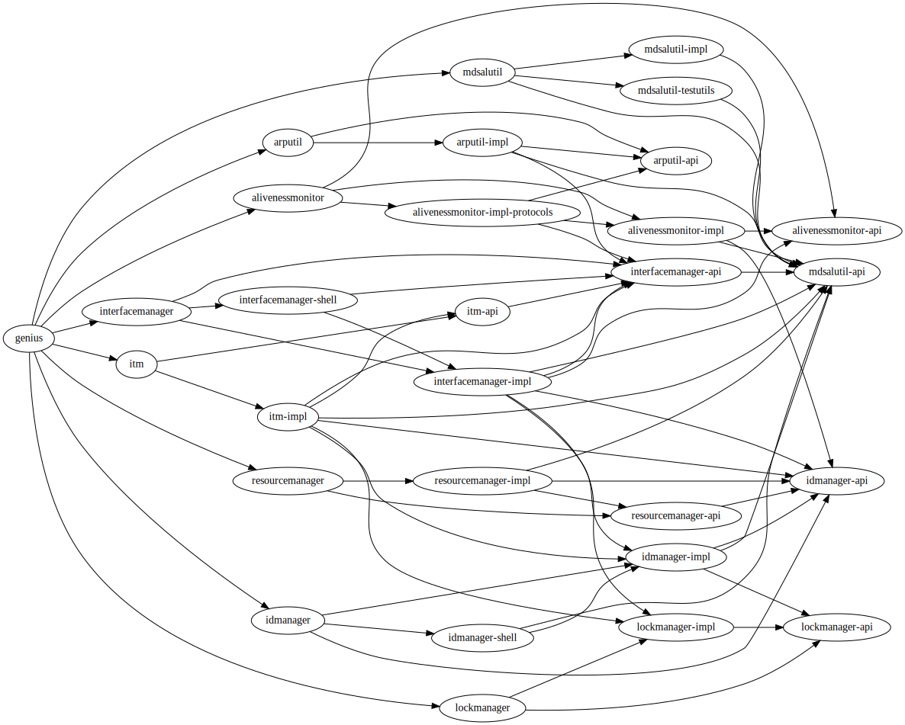

======================
Genius Design Overview
======================

Genius project provides generic infrastructure services and utilities for 
integration and co-existance of mulltiple networking services/applications.
Following image presents a top level view of Genius framework -

.. image:: https://wiki.opendaylight.org/images/3/3e/Genius_overview.png
    :align: center
    :height: 400px
    :width: 800px

Genius Module Dependencies
==========================

Genius modules are developed as karaf features which can be independently
installed. However, there is some dependency among these modules. The
diagram below provides a dependency relationship of these modules.

All these modules expose Yang based API which can be used to 
configure/interact with these modules and fetch  services provided by 
these modules. Thus all these modules can be used/configured by other 
ODL modules and can also be accessed via REST interface.

Genius based packet pipeline
============================

Following picture presents an example of packet pipeline based on Genius framework.
It also presents the functions of diffrent genius components -

.. image:: https://wiki.opendaylight.org/images/5/56/App_co_exist_new.png
   :scale: 80 %
   :align: center

Following sections provide details about each of these components.

.. toctree::
   :maxdepth: 1
   
   interface-manager-design
   ITM-design
   datastore-job-coordinator

#. Aliveness Monitor
#. ID-Manager
#. MDSAL Utils
#. Resource Manager
#. FCAPS manager
   
   